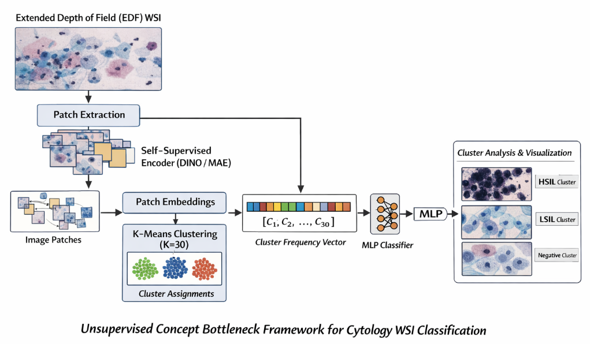
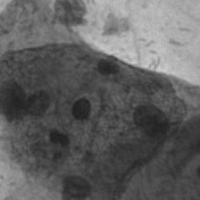

# Pap Smear Concept Bottleneck Pipeline



This repository implements a **self-supervised concept bottleneck pipeline for Pap smear cytology analysis**.  
Instead of training a direct CNN classifier, the system first learns **morphological representations**, discovers **cellular concepts via clustering**, and then performs **slide-level classification**.

The goal is to obtain **interpretable representations of cytological morphology** while maintaining competitive classification performance.

---

# Example Morphological Clusters

Below are example patches from discovered clusters.

### Cluster Example 1


### Cluster Example 2


These clusters represent **morphological groupings of cytology patches** discovered through unsupervised learning.

---

# Current Implementation

The following pipeline has been implemented:

### 1. Patch Extraction

Whole slide frames from the **Cervix93 Pap smear dataset** are segmented into smaller image patches for representation learning.

```
WSI Frames → Image Patches
```

---

### 2. Self-Supervised Representation Learning (DINO)

A **Vision Transformer trained using DINO** learns morphological representations without labels.

```
Patch Images → DINO Encoder → Feature Embeddings
```

Each patch is encoded as a:

```
384-dimensional feature vector
```

---

### 3. Embedding Extraction

All patches are passed through the trained encoder.

Output:

```
5488 patches
↓
384-dimensional embeddings
```

Saved as:

```
embeddings/patch_embeddings.npy
```

---

### 4. Unsupervised Morphology Clustering

Patch embeddings are grouped using **K-Means clustering**.

```
Embeddings → KMeans (K=30) → Morphology Clusters
```

Each patch receives a **cluster ID representing a morphological concept**.

Saved outputs:

```
clusters/cluster_labels.npy
clusters/cluster_centers.npy
```

---

### 5. Cluster Visualization

Representative patches are extracted from each cluster to inspect the **learned morphology patterns**.

Example clusters may include:

- mature squamous cells  
- dense nuclear structures  
- inflammatory cell patterns  
- cytoplasmic morphology groups  

---

### 6. Slide-Level Concept Representation

Patch clusters are aggregated into **slide-level feature vectors**.

Each slide becomes a vector representing **cluster frequency distribution**.

Example:

```
Slide → [Cluster1, Cluster2, ..., Cluster30]
```

Output:

```
93 slides
30-dimensional concept vectors
```

Saved as:

```
features/slide_features.npy
```

---

### 7. Slide Classification

A lightweight classifier is trained on the concept vectors to predict:

```
Negative
LSIL
HSIL
```

This forms an **interpretable Concept Bottleneck Model**.

---

# Dataset

Dataset used:

**Cervix93 Pap Smear Dataset**

Contains:

```
93 image stacks
Negative: 16
LSIL: 46
HSIL: 31
```

Each stack contains frames with **annotated cervical cells**.

Dataset must be downloaded separately and placed in:

```
ssl_dataset/all
```

---

# Project Pipeline

```
Pap Smear WSI Frames
        ↓
Patch Extraction
        ↓
Self-Supervised Representation Learning (DINO)
        ↓
Patch Embeddings
        ↓
KMeans Morphology Clusters
        ↓
Cluster Visualization
        ↓
Slide-Level Concept Vectors
        ↓
Slide Classification
```

---

# Repository Structure

```
pap-smear-concept-bottleneck
│
├── src/
│   ├── extract_embeddings.py
│   ├── cluster_embeddings.py
│   ├── visualize_clusters.py
│   ├── build_slide_features.py
│   └── train_slide_classifier.py
│
├── pipeline.png
├── cluster1.png
├── cluster2.png
│
├── README.md
└── requirements.txt
```

Large artifacts such as datasets, embeddings, and model checkpoints are **not stored in the repository**.

---

# Running the Pipeline

After dataset setup:

```bash
python src/extract_embeddings.py
python src/cluster_embeddings.py
python src/visualize_clusters.py
python src/build_slide_features.py
python src/train_slide_classifier.py
```

---

# Future Work

Planned extensions include:

- **Cluster enrichment analysis** for HSIL vs LSIL  
- **Concept importance analysis**  
- **Temporal progression modeling across patient visits**  
- Integration with **longitudinal clinical datasets**